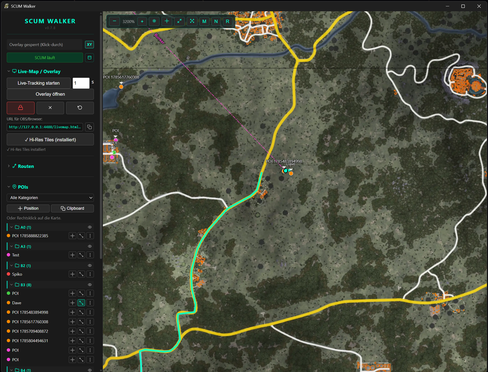
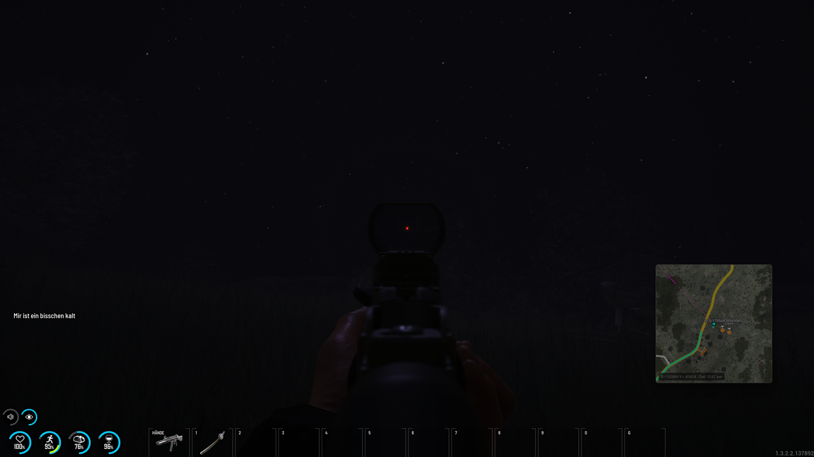
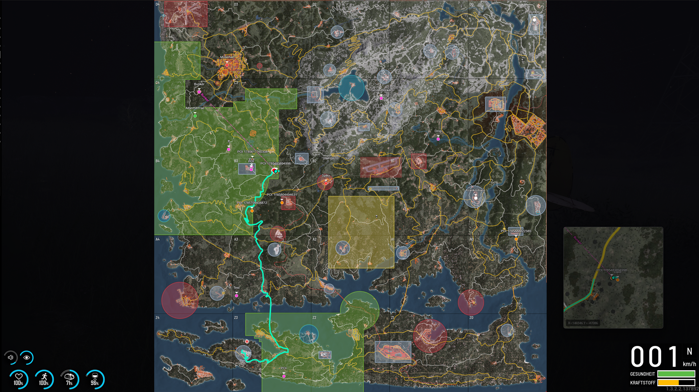
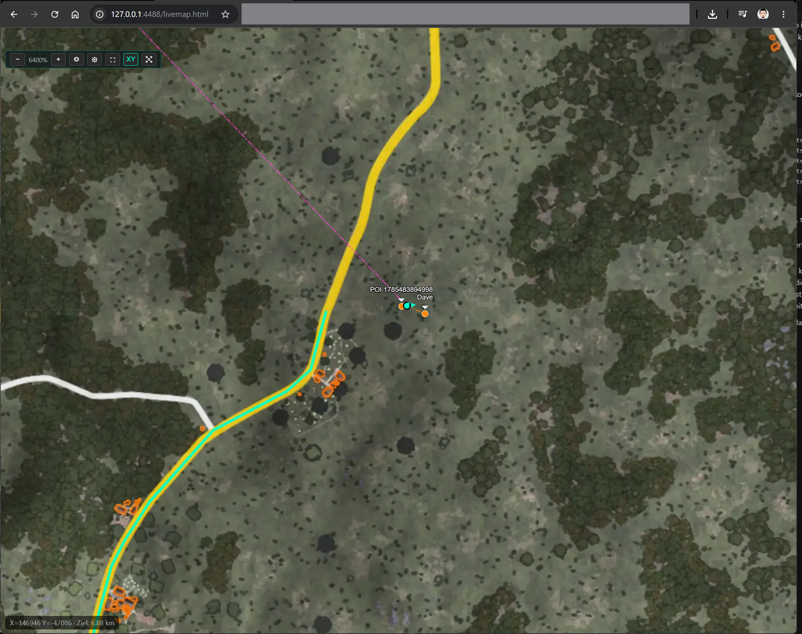
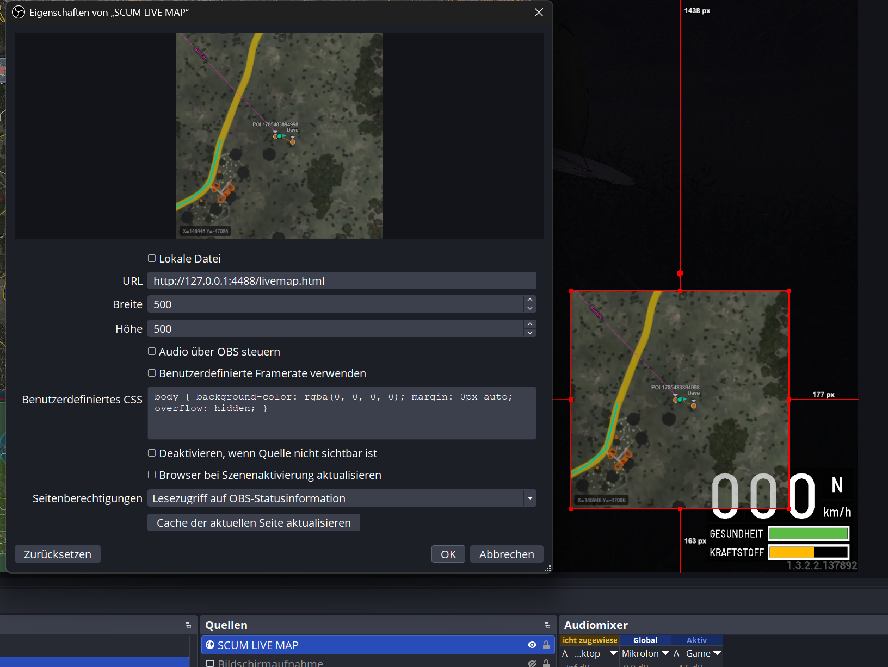

# SCUM Walker

**SCUM Walker is the all-in-one companion app for SCUM.**

Live position tracking, route recorder & road navigation, POIs for gear/crates/cars, F9 in-game screenshots with instant POI creation, and a built-in OBS/browser overlay – all without leaving the game.

<p align="center">
  <a href="https://github.com/HellBz/SCUM-Walker/releases/latest"></a>
  <a href="./src-tauri/LICENSE.txt"></a>
  <a href="https://www.twitch.tv/hellbz"></a>
  <a href="https://discord.gg/tuzpmeZ"></a>
</p>

[](screenshots/app.png)

## Features

- **Live Tracking** – Automatically reads your position from SCUM via key simulation
- **Interactive Map** – Leaflet-based offline map with zoom levels 0–6
- **Route Recorder** – Record your paths, color-coded and exportable (JSON/CSV)
- **Road Navigation** – Plan a driving route on the road network; right-click on the live map to set a destination
- **POI Markers** – Place points of interest via right-click or from current position
- **POI Import / Share** – Import POIs from your clipboard or share them with others
- **Overlay Mode** – Transparent always-on-top window for OBS/streaming
- **Browser/OBS Integration** – Live-Map URL for browser sources in OBS
- **Hi-Res Tiles** – Optional high-resolution map tiles (zoom 4–6) via in-app download
- **Auto-Updater** – Notifies about new releases and installs updates from GitHub

## Community & Support

- [All my socials](https://linktr.ee/HellBz) – Twitch, X/Twitter, Instagram, YouTube and more
- [Twitch](https://www.twitch.tv/hellbz) – watch live SCUM streams
- [Our Discord](https://discord.gg/tuzpmeZ) – chat, feedback and support
- [Nuclear Island SCUM server](https://de.top-games.net/scum/nuclear-island-geren-pvppve) – the server we play on
- [Nuclear Island Discord](https://discord.com/invite/nuclearisland)

## Installation

### Download

Grab the latest installer from [Releases](https://github.com/HellBz/SCUM-Walker/releases):

- **Windows**: `.msi` or `.exe` (NSIS installer) — fully supported
- **Linux**: `.deb` or `.AppImage` — provided, not officially supported
- **macOS**: `.dmg` — provided, not officially supported

> **Note:** Screenshot capture, the auto-updater and some Windows-specific features are only fully supported on Windows. Linux and macOS builds are provided as-is and can be installed, but are not officially supported.

After installing, launch the app and click **"⬇ Hi-Res Tiles"** in the sidebar to download high-resolution map tiles for zoom levels 4–6.

### Build from Source

```bash
git clone https://github.com/HellBz/SCUM-Walker.git
cd SCUM-Walker/src-tauri
cargo run
```

Requirements:
- [Rust](https://rustup.rs/)
- [Node.js](https://nodejs.org/) 20+
- On Linux: `libwebkit2gtk-4.1-dev`, `libgtk-3-dev`, `libayatana-appindicator3-dev`

## Usage

| # | English | Deutsch |
|---|---|---|
| 1 | Launch SCUM Walker and start SCUM. | Starte SCUM Walker und SCUM. |
| 2 | Click **"Live-Tracking starten"** to begin tracking your position. | Klicke auf **"Live-Tracking starten"**, um deine Position zu tracken. |
| 3 | Your player marker appears on the map with a directional arrow. | Dein Spieler-Marker erscheint mit Richtungspfeil auf der Karte. |
| 4 | Right-click the map to place POIs. | Rechtsklick auf die Karte setzt POIs. |
| 5 | Create routes in the sidebar and record your paths. | Erstelle Routen in der Sidebar und zeichne deine Wege auf. |
| 6 | Open the **Overlay** and click the lock button to make it transparent and click-through. | Öffne das **Overlay** und nutze den Lock-Button, damit es transparent und klick-durch ist. |

## In-Game Shortcuts

| Shortcut | English | Deutsch |
|---|---|---|
| **F9** | Take an in-game screenshot and automatically create a POI. | Macht einen Ingame-Screenshot und erstellt automatisch einen POI. |
| **AltGr + M** | Open the in-game map overlay while playing. | Öffnet das Ingame-Map-Overlay während des Spielens. |

## Screenshots

Click any image to see it full-size.

<table>
  <tr>
    <td align="center">
      <b>In-game POI photo</b><br>
      <a href="screenshots/ingame-photo.png"></a><br>
      <sub>Press F9 in-game to take a screenshot and automatically create a POI marker.</sub>
    </td>
    <td align="center">
      <b>In-game map</b><br>
      <a href="screenshots/ingame-map.png"></a><br>
      <sub>The live map with player position, recorded routes and navigation overlay while in-game.</sub>
    </td>
  </tr>
  <tr>
    <td align="center">
      <b>Browser integration</b><br>
      <a href="screenshots/browser.png"></a><br>
      <sub>Open the generated Live-Map URL in any browser or use it on a second monitor.</sub>
    </td>
    <td align="center">
      <b>OBS integration</b><br>
      <a href="screenshots/obs.png"></a><br>
      <sub>Add the Live-Map URL as a Browser Source in OBS to show the map overlay on stream.</sub>
    </td>
  </tr>
</table>

## Tech Stack

- **Tauri 2.0** (Rust + WebView)
- **Leaflet.js** for map rendering
- **Python** for tile generation

## License

MIT

